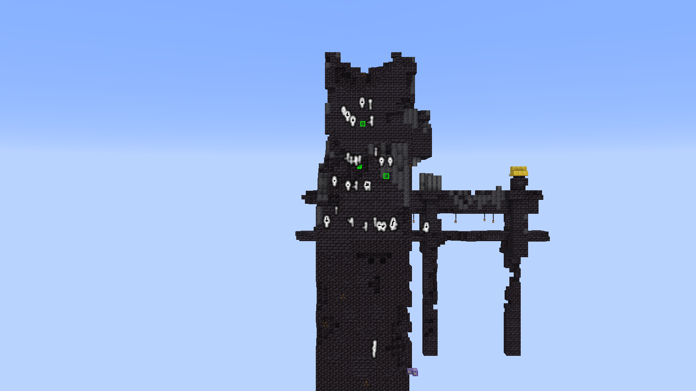
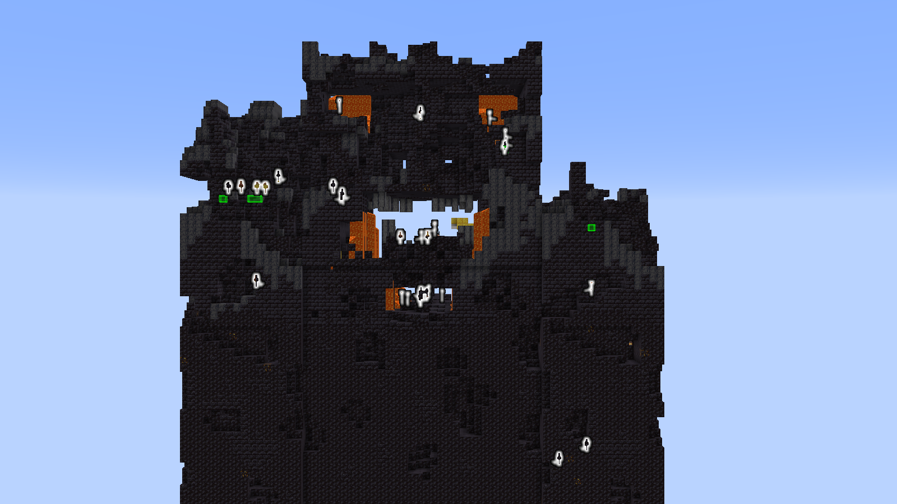
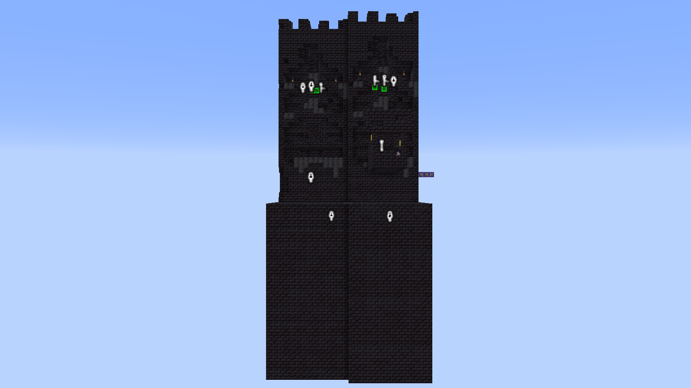
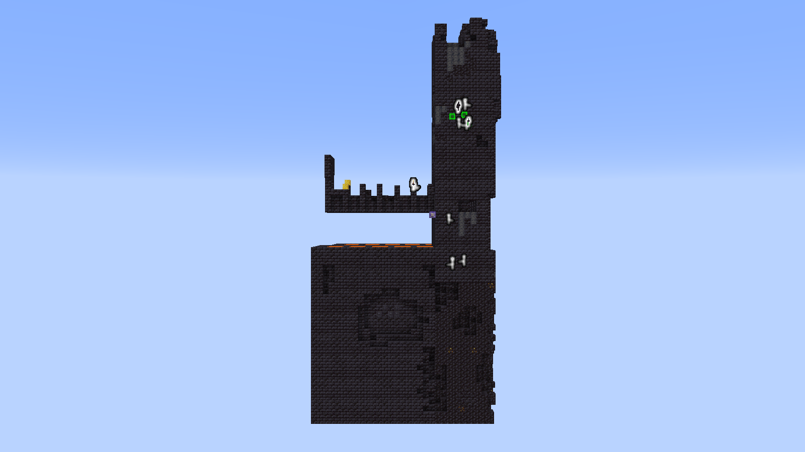
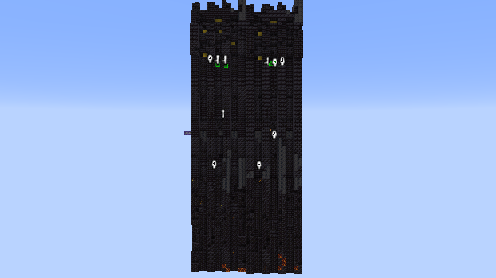
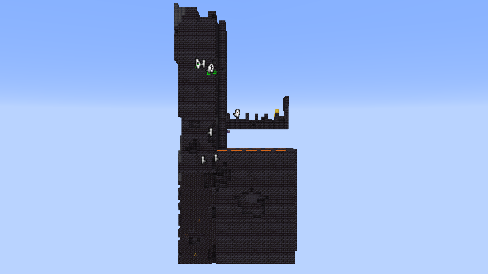
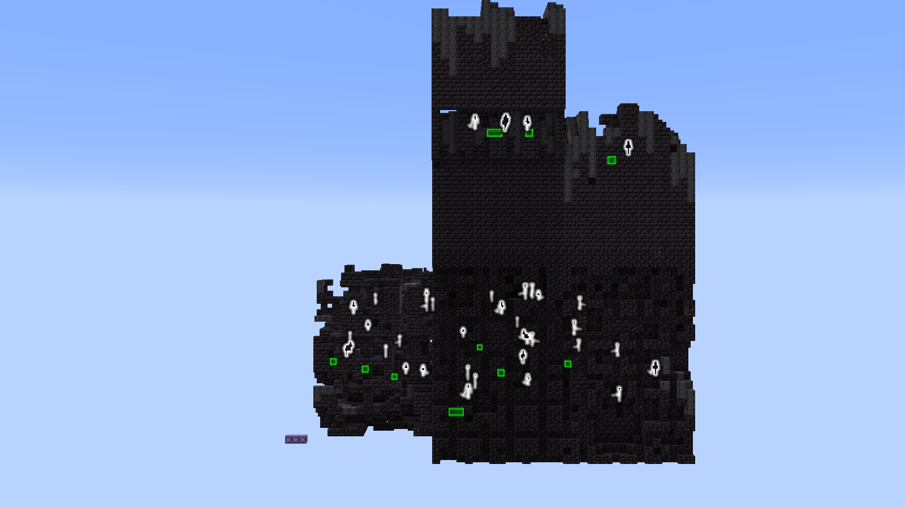
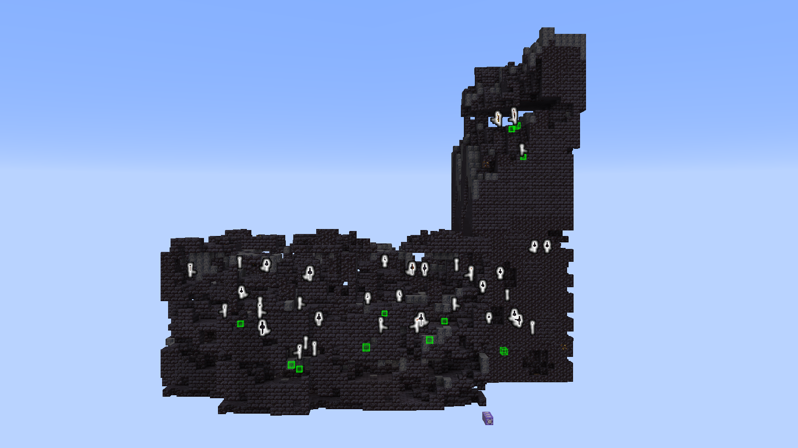

= Bastions

= Generation
[regions](../../regions) *size* *biomes*

== Locating
*TODO: go over entity xraying*

== Types

=== Bridges
==== Identifying
.Bridge Bastion when viewed from the chalice
[caption=""]
image::bridge/Chalice.png[1280, 720]
[cap]

.Bridge Bastion when viewed from the left shoulder
[caption=""]

[cap]

.Bridge Bastion when viewed from the back
[caption=""]

[cap]

.Bridge Bastion when viewed from the right shoulder
[caption=""]
image::bridge/ShoulderRight.png[1280, 720]
[cap]

*TODO: written description of bridges*

==== Routes
*TODO: links to section talking about each route*

=== Treasure Room
==== Identifying
===== Ramparts
.Treasure Bastion ramparts when viewed from the front
[caption=""]

.Treasure Bastion ramparts when viewed from the left
[caption=""]

.Treasure Bastion ramparts when viewed from the back
[caption=""]

.Treasure Bastion ramparts when viewed from the right
[caption=""]

*TODO: written description of treasure*

==== Routes
*TODO: links to section talking about each route*

=== Housing
==== Identifying
.Housing Bastion ramparts when viewed from the front
[caption=""]
image::housing/Front.png[1280, 720]

.Housing Bastion ramparts when viewed from the left
[caption=""]
image::housing/Left.png[1280, 720]

.Housing Bastion ramparts when viewed from the back
[caption=""]

.Housing Bastion ramparts when viewed from the right
[caption=""]

*TODO: written description of housing*

==== Routes
*TODO: links to section talking about each route*

=== Stables
*TODO: write section*
